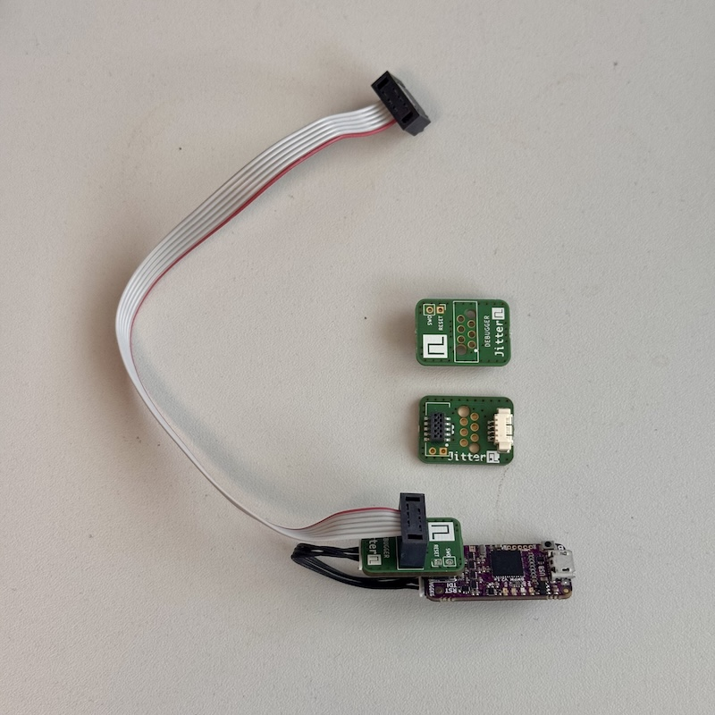
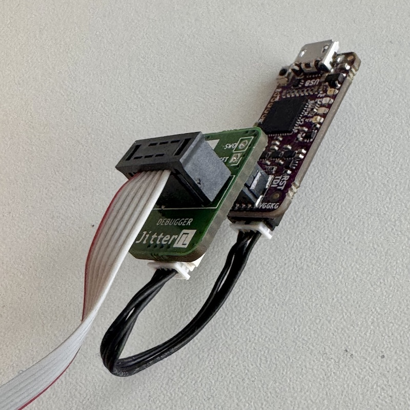
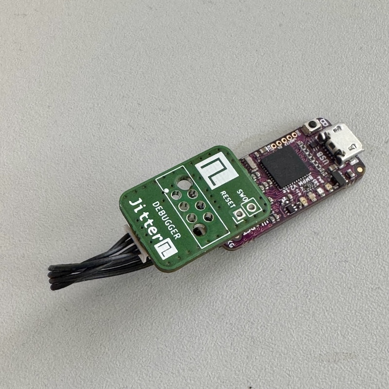

# Black Magic Probe - Wurth REDFIT IDC SKEDD  adapter

Adapter PCB to connect a 6 pins REDFIT IDF SKEDD connector

Part | Manufacturer | Order Code | URL
---|---|---|---
Pre-Pressed Cable | Wurth | 490107670612S | [we-online.com](https://www.we-online.com/en/components/products/WST_IDC_PRE_PRESSED_CONNECTOR)
Pre-assembled microfit cable | Molex | 15134-0403 | [mouser.com](https://nl.mouser.com/ProductDetail/Molex/15134-0403?qs=lQAVKuKFhkLu7CXcmGugBw%3D%3D&srsltid=AfmBOoq-VHjKAoBdyCqXlhLaALFQdVgOT6IXxwn07GbCf_t-Lxjgn7qN)

## Impressions

